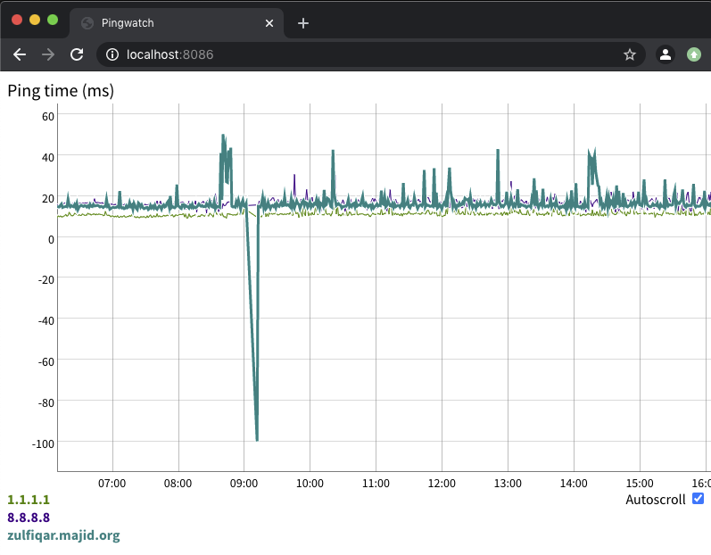

# pingwatch
Simple monitoring tool for your Internet connection, pings hosts and reports on availability and trends

## Screen shot



## Building

Prerequisites:

* Go 1.13 or later

```
git clone https://github.com/fazalmajid/pingwatch
cd pingwatch
go build
```

On Linux, run:

```
sudo setcap cap_net_raw=+ep pingwatch
```

this allows `pingwatch` to open raw sockets so it can send ICMP packets.

You can get a list of command-line flags using `pingwatch -h`

## Database

The list of hostnames or IPs to ping is in the table `dests`.

To add a destination, run:

```
```

The actual measurements are in the table `pings`:

* *time* timestamp in SQLite julian day format, UTC)
* *host* hostname that was pinged
* *ip* IPv4 or IPv6 address *host* resolved to at ping time
* *rtt* ping round-trip time in milliseconds

You can use sqlite Triggers to automatically clear old entries to keep the database small

This trigger will delete entries from table pings which are older than 1 day:

```
sqlite3 pingwatch.sqlite << EOF
CREATE TRIGGER clean1day AFTER INSERT ON pings
BEGIN
	delete from pings where pings.time < julianday('now','-1 day');
END
EOF

``` 

Refer to the [julianday() function manual](https://sqlite.org/lang_datefunc.html) for details


## Web user interface

The web user interface can be accessed at http://localhost:8086/ by default (or change it using the `-p` flag).

By convention, a ping time of -100ms means timeout, so downtime can stand out in the graph. In the SQLite database, this is stored as -3600e3

You can zoom in by selecting a time range, scroll using by pressing Shift while moving the mouse or zoom out back to the original view by double-clicking (graphs are courtesy of the awesome [Dygraphs](https://dygraphs.com) library).
